# 📋 Sistema de Gestión de Firmas Electrónicas

## 🎯 Descripción

**Sistema completo de gestión de firmas electrónicas** con infraestructura PKI propia, notificaciones en tiempo real y capacidades de firma digital avanzadas. Diseñado para entornos empresariales que requieren autenticación segura y gestión documental con validez legal.

### 🌟 Características Principales

- 🔐 **Autenticación JWT** con verificación de email
- 📜 **Autoridad Certificadora (CA) propia** con OpenSSL
- ✍️ **Firmas digitales** con PyHanko + certificados X.509
- 📨 **Solicitudes de firma** entre usuarios
- 🔔 **Notificaciones en tiempo real** con Socket.IO
- 📄 **Gestión completa de documentos** PDF
- 👑 **Panel de administración** para gestión del sistema
- 🛡️ **Cifrado end-to-end** de archivos sensibles

## 🚀 Instalación Rápida

### Prerrequisitos
```bash
node --version    # v18+
python --version  # 3.8+
mysql --version   # 8.0+
```

### Configuración
```bash
# Clonar y configurar backend
git clone <repository-url> && cd firmaelectronica/backend
npm install && npm run init-db && npm run init-certificates

# Configurar frontend
cd ../frontend && npm install
echo "VITE_API_URL=https://firmaelectronica.local:3001/api" > .env.local

# Configurar PyHanko
cd ../backend/pyhanko-signservice
python -m venv venv && venv\Scripts\activate && pip install -r requirements.txt
```

### Ejecutar
```bash
# 3 terminales:
cd backend && npm start
cd frontend && npm run dev  
cd backend/pyhanko-signservice && python app.py
```

## 🏗️ Arquitectura

### Stack Tecnológico
- **Backend**: Node.js + Express + MySQL + Socket.IO
- **Frontend**: React 19 + Vite + Material-UI + PDF.js
- **Firma Digital**: Python Flask + PyHanko
- **Seguridad**: JWT + OpenSSL + AES-256

## 📊 Casos de Uso

```mermaid
graph TD
    A[Usuario Registrado] --> B[Iniciar Sesión]
    B --> C[Dashboard]
    
    C --> D[Gestión de Firmas]
    D --> D1[Subir Firma Digital]
    D --> D2[Gestionar Firmas Existentes]
    D --> D3[Descargar Firma]
    
    C --> E[Solicitudes de Firma]
    E --> E1[Enviar Documento para Firma]
    E --> E2[Recibir Solicitudes]
    E --> E3[Firmar Documento]
    E --> E4[Rechazar Solicitud]
    
    C --> F[Gestión de Documentos]
    F --> F1[Documentos Firmados]
    F --> F2[Documentos Sin Firmar]
    F --> F3[Descargar/Eliminar]
    
    C --> G[Certificados Digitales]
    G --> G1[Solicitar Certificado]
    G --> G2[Gestionar Certificados]
    
    C --> H[Notificaciones]
    H --> H1[Notificaciones en Tiempo Real]
    H --> H2[Historial de Notificaciones]
    
    Admin[Administrador] --> AdminDash[Panel de Administración]
    AdminDash --> A1[Gestión de Usuarios]
    AdminDash --> A2[Gestión de Certificados]
    AdminDash --> A3[Monitoreo del Sistema]
    AdminDash --> A4[Gestión de CA]
```



## � Funcionalidades Principales

### � Autenticación y Seguridad
- **JWT tokens** con verificación de email obligatoria
- **HTTPS** con certificados SSL autofirmados
- **Cifrado AES-256** para documentos sensibles
- **Headers de seguridad** con Helmet.js
- **Autoridad Certificadora propia** para PKI

### ✍️ Sistema de Firmas
1. **Firma Simple**: Imagen de firma aplicada visualmente
2. **Firma Digital**: Certificado X.509 con PyHanko
3. **Firma Completa**: Visual + Digital + QR de verificación

### 📨 Solicitudes de Firma
- **Envío entre usuarios** con notificaciones en tiempo real
- **Visualización integrada** de PDFs
- **Aprobación/Rechazo** con trazabilidad completa
- **Historial** de todas las solicitudes

### 🔔 Notificaciones en Tiempo Real
```javascript
// Eventos WebSocket disponibles
socket.on('notification', data => {})      // Generales
socket.on('signatureRequest', data => {}) // Solicitudes  
socket.on('documentSigned', data => {})   // Firmados
socket.on('certificateApproved', data => {}) // Certificados
```

## 📡 API Reference

### Endpoints Principales
| Método | Endpoint | Descripción |
|--------|----------|-------------|
| `POST` | `/api/auth/register` | Registro de usuario |
| `POST` | `/api/auth/login` | Inicio de sesión |
| `POST` | `/api/signatures/sign-document` | Firmar documento |
| `POST` | `/api/signature-requests/send` | Enviar solicitud |
| `POST` | `/api/ca/export-p12` | Exportar certificado |

### Configuración Variables (.env)
```env
# Base de datos
DB_HOST=localhost
DB_NAME=firma_electronica  
DB_USER=tu_usuario
DB_PASSWORD=tu_password

# Seguridad
JWT_SECRET=clave_jwt_64_caracteres
SIGNED_DOC_MASTER_KEY=clave_cifrado_32_chars

# Servicios  
FRONTEND_URL=https://firmaelectronica.local:5173
PYHANKO_URL=http://127.0.0.1:5001
```

## 📁 Estructura del Proyecto

```
firmaelectronica/
├── backend/                    # Node.js API Server
│   ├── certificates/          # PKI Infrastructure  
│   ├── controllers/           # Business Logic
│   ├── models/               # Database Models
│   ├── routes/               # API Routes
│   ├── pyhanko-signservice/  # Python Microservice
│   └── server.js             # Main Server
├── frontend/                  # React Application
│   ├── src/components/       # UI Components
│   ├── src/contexts/         # Context API
│   └── src/config/           # Configuration
└── dns-config/               # Local DNS Setup
```

## 🧪 Scripts de Desarrollo

### Backend
```bash
npm start                 # Servidor producción
npm run dev              # Desarrollo con nodemon
npm run init-db          # Inicializar BD
npm run init-certificates # Configurar PKI
```

### Frontend  
```bash
npm run dev              # Servidor desarrollo
npm run build            # Build producción
npm run preview          # Preview build
```

## 🚀 Deployment

### Docker Compose
```yaml
version: '3.8'
services:
  backend:
    build: ./backend
    ports: ["3001:3001"]
    environment:
      - NODE_ENV=production
  frontend:
    build: ./frontend
    ports: ["5173:5173"]
  db:
    image: mysql:8.0
    environment:
      MYSQL_DATABASE: firma_electronica
```

### Variables de Producción
```bash
export NODE_ENV=production
export DB_HOST=tu_servidor_mysql
export JWT_SECRET=clave_super_segura_64_chars
```

## 🛡️ Seguridad Implementada

| Componente | Medida de Seguridad |
|------------|-------------------|
| **Autenticación** | JWT + bcrypt + email verification |
| **Comunicación** | HTTPS + CORS + Security Headers |
| **Almacenamiento** | AES-256 encryption + unique keys |
| **PKI** | Self-signed CA + X.509 certificates |
| **Validación** | Input sanitization + SQL injection prevention |

## 📈 Monitoreo

### Logs del Sistema
- `/logs/auth.log` - Autenticación
- `/logs/signatures.log` - Firmas digitales
- `/logs/certificates.log` - Gestión PKI
- `/logs/error.log` - Errores del sistema

### Mantenimiento Automático
- **Limpieza de temporales**: Cada hora
- **Documentos expirados**: Diario 2 AM
- **Rotación de logs**: Semanal

## 🤝 Contribución

```bash
# Flujo de desarrollo
git checkout -b feature/nueva-funcionalidad
git commit -m "feat: agregar nueva funcionalidad"  
git push origin feature/nueva-funcionalidad
# Crear Pull Request
```

## 📞 Soporte

### Problemas Comunes
```bash
# Error certificados
npm run init-certificates

# Error base de datos
npm run init-db

# Puerto ocupado (Windows)
netstat -ano | findstr :3001
taskkill /PID <PID> /F
```

### Documentación
- **[Documentación Completa](./README_COMPLETO.md)** - Análisis detallado
- **[Configuración SSL](./certificates/)** - Setup PKI
- **[API Docs](./docs/)** - Reference completa

## 📄 Licencia

**MIT License** - Ver [LICENSE](./LICENSE) para detalles.

---

**🔗 Enlaces**: [Docs Completas](./README_COMPLETO.md) | [API](./docs/API.md) | [Troubleshooting](./docs/TROUBLESHOOTING.md)

**📊 Versión**: 2.0 | **📅 Actualización**: Agosto 2025
- MySQL
- npm o yarn

## Configuración

### Backend

1. Navegar al directorio del backend:
```bash
cd backend
```

2. Instalar dependencias:
```bash
npm install
```

3. Crear archivo `.env` en el directorio actual con las siguientes variables:
```
PORT=puerto
DB_HOST=host_de_tu_db
DB_PORT=puerto_de_tu_db
DB_NAME=nombre_de_tu_db
DB_USER=tu_usuario
DB_PASSWORD=tu_contraseña
JWT_SECRET=tu_secreto_super_seguro
FRONTEND_URL=http://localhost:3000
SIGNED_DOC_MASTER_KEY=clave_maestra_segura_para_docs
PYHANKO_URL=http://127.0.0.1:5001
```

4. Iniciar la base de datos:
```bash
npm run init-db
```

5. Iniciar el servidor:
```bash
npm start
```

### Frontend

1. Navegar al directorio del frontend:
```bash
cd frontend
```

2. Crear archivo `.env` en el directorio actual con las siguientes variables:
```
VITE_API_URL=http://localhost:3443/api
```

3. Instalar dependencias:
```bash
npm install
```

4. Iniciar el servidor de desarrollo:
```bash
npm run dev
```

### Microservicio PyHanko (firma digital)

1. Navegar a `backend/pyhanko-signservice`:
```bash
cd backend/pyhanko-signservice
```

2. Crear y activar un entorno virtual:
```bash
python -m venv venv
venv\Scripts\activate  # En Windows
source venv/bin/activate  # En Linux/Mac
```

3. Instalar dependencias:
```bash
pip install -r requirements.txt
```

4. Iniciar el microservicio:
```bash
python app.py
```

## Estructura del Proyecto

```
├── backend/
│   ├── config/
│   ├── controllers/
│   ├── models/
│   ├── routes/
│   ├── utils/
│   ├── uploads/
│   ├── pyhanko-signservice/  # Microservicio de firma digital
│   ├── server.js
│   └── package.json
├── frontend/
│   ├── src/
│   │   ├── components/
│   │   ├── config/
│   │   ├── contexts/
│   │   └── App.jsx
│   └── package.json
└── README.md
```

## Flujo de Firma Digital

1. El usuario sube un PDF y selecciona su certificado digital (.p12).
2. El frontend permite previsualizar y posicionar la estampa visual (QR + datos del certificado) sobre el PDF.
3. El PDF con la estampa se envía al backend, que lo reenvía al microservicio PyHanko para la firma digital legalmente válida.
4. El backend cifra el PDF firmado y lo almacena en la base de datos.
5. El usuario puede ver, descargar o eliminar sus documentos firmados desde la sección "Documentos Firmados".

## Seguridad

- Contraseñas encriptadas con bcrypt
- Tokens JWT para autenticación
- Protección contra CSRF
- Validación y sanitización de datos
- Documentos firmados cifrados con AES-GCM y clave única por documento
- Clave maestra para documentos en `.env` (no subir nunca a GitHub)
- Certificados digitales gestionados de forma segura

## Licencia

Este proyecto está bajo la Licencia MIT. 